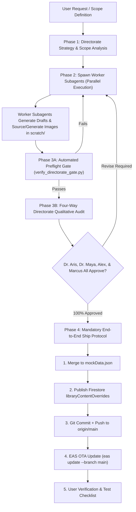

# /library-lead-directorate: Lead Directorate Content Overhaul, Visuals & Ship Gate

The **Lead Directorate** is the premier quality assurance, editorial, and visual governing body for the `MD Community Medicine` app Library. It unites four specialized director-level agents who oversee the end-to-end transformation of raw notes or study materials into authoritative, textbook-grade medical treatises complete with essential clinical diagrams and infographics.

The Directorate operates on a strict **Dual-Track Cognitive Model**:
1. **Track 1 (Autonomous Textbook Reference & Visuals):** The body prose reads with the dignity, authority, and formal medical register of *Park's Textbook of Preventive and Social Medicine*. High-yield clinical, epidemiological, and health system diagrams visually anchor complex processes. Body prose is 100% free of tuition slang, coaching colloquialisms, and conversational prompts.
2. **Track 2 (Bounded Exam Mentor Cards):** All tactical exam framing, answer blueprints, scoring strategies, and high-yield distinctions are strictly segregated inside dedicated `> **EXAM TIP:**` callouts.

---

## The Four Lead Directors

| Director | Role | Mandate & Audit Criteria | Reference Rubric |
| :--- | :--- | :--- | :--- |
| **Dr. Aris** | Medical Education & Academic Content Director | **Postgraduate Pedagogy & Voice:** Eradicates conversational coaching (`residents should`, `write this`, `examiners accept`, `India hook`). Ensures formal medical textbook syntax. Enforces that all tactical scoring advice is isolated into `> **EXAM TIP:**` callouts. | `references/dr-aris-rubric.md` |
| **Dr. Maya** | Source Synthesis & Knowledge Architecture Lead | **Three-Tier Knowledge Hierarchy:** Reconciles Park foundations, Golden Notes additions, and latest Indian health data (SRS, NFHS, NP-NCD, IPHS). Crafts dynamic, intellectually engaging chapter Overviews (no cookie-cutter templates). Purges in-text author name-dropping (`According to Park`). | `references/dr-maya-rubric.md` |
| **Alex** | Product Design, UX & Reader Experience Lead | **Mobile Cognitive Ergonomics:** Enforces 4-line / 60-word paragraph ceiling, 100% bold semantic anchors on bullets (`- **Anchor:**`), zero em-dashes (`U+2014`), and parser safety in `ReadingView.js` (blank lines after `[SN]`/`[LAQ]`, zero tag dumps before overview, sub-list indentation). | `references/alex-ux-rubric.md` |
| **Marcus** | Medical Visuals & Clinical Imagery Director | **Visual Pedagogy & Infographics Architecture:** Audits chapters for essential diagrams, flowcharts, schemas, and clinical images. Directs subagents to procure them from authoritative Internet sources (Wikimedia, WHO, CDC, MoHFW) or generate custom infographics via ChatGPT using the `orca-cli` skill. Ensures clean markdown syntax and tap-to-fullscreen rotation compatibility. | `references/marcus-visuals-rubric.md` |

---

## Four-Phase Directorate Workflow



---

## Phase 1: Directorate Strategy & Scope Analysis

Before writing any code or spawning workers, the Directorate analyzes the target scope:
1. **Identify Included vs Excluded Chapters:**
   - Default core chapters: Chapters 1 through 13, 21, 22, 23, 27, 29.
   - External resource chapters: Verify if chapters are derived from non-Park sources (e.g. Biostats, Research Methodology, Health Economics, Current Health Status, Recent Advances).
2. **Resolve Ground Truth Sources:**
   - Locate corresponding Park PDFs in `D:\Study Related\Books\Park Split\`.
   - Locate relevant Golden Notes chapters in `D:\Study Related\Books\Golden Notes Split\`.
   - Identify Tier 1 real-time Indian health data (SRS 2024, NFHS-5/6, NITI Aayog, MoHFW).
3. **Overview Strategy Formulation (Dr. Maya):**
   - Extract the chapter opening and core themes from the source materials.
   - Formulate a tailored overview concept combining a philosophical epigram, paradigmatic shift, and Indian public health relevance.
4. **Visual Mapping & Image Need Strategy (Marcus):**
   - Identify the essential clinical diagrams, epidemiological flowcharts, program architecture blueprints, or decision trees needed.
   - Specify whether each image will be sourced from authoritative Internet repositories or generated via ChatGPT using `orca-cli`.

---

## Phase 2: Dynamic Worker Subagent Spawning

The Directorate spawns as many dedicated worker subagents as required to process the work in parallel:
- **Concurrency Rule:** Spawn 1 worker specialist per chapter or logical subsection group.
- **Worker Prompt Template:** Use the standardized template in `references/worker-subagent-template.md`.
- **Visuals Mandate:** Workers must evaluate visual needs, source/generate high-yield medical diagrams, and embed them using clean markdown syntax (``).
- **Sandbox Isolation:** Workers must NEVER edit `src/data/mockData.json` directly. Each worker outputs its overhauled chapter JSON to:
  ```
  <conversation-id>/scratch/cleaned_ch_<chapter_id>.json
  ```

---

## Phase 3: Directorate Verification & Sign-Off Gate

No work may be merged or shipped without passing both automated and qualitative audit gates.

### 3A. Automated Preflight Gate
Run the directorate preflight script on the worker output files:
```bash
python .agents/skills/library-lead-directorate/scripts/verify_directorate_gate.py "<output_json_path>"
```
- **Fails if:**
  - Any banned conversational phrase (`residents should`, `write this`, `India hook`) is found in body text.
  - Any em-dash (`U+2014`) is present.
  - Any `[SN]` or `[LAQ]` tag is dumped before `OVERVIEW` or lacks a trailing blank line.
  - In-text textbook citations (`According to Park`) are detected.
  - Any image markdown syntax is malformed or missing bounding blank lines.
- If preflight fails, the worker must resolve all issues before proceeding.

### 3B. Four-Way Qualitative Directorate Audit
Invoke or message the 4 lead agents to conduct their formal reviews:
1. **Dr. Aris Review:** Audits textbook register, complete absence of exam coaching in body text, and postgraduate pedagogical depth.
2. **Dr. Maya Review:** Audits overview intellectual quality, preservation of Tier 1 official statistics and Tier 2 Golden Notes comparison tables without flattening, and absence of author name-dropping.
3. **Alex Review:** Audits mobile paragraph ceiling (max 4 lines), 100% bold semantic anchors on root bullets, sub-list indentation, and `ReadingView.js` parser safety.
4. **Marcus Review:** Audits visual pedagogical coverage, ensuring every high-yield conceptual domain has an accurate, high-resolution diagram/infographic sourced from the Internet or generated via ChatGPT using `orca-cli`.

**Sign-off Standard:** Each director must issue an explicit written verdict: **APPROVED** or **REVISE REQUIRED** (with exact line/leaf punch lists). If any director requests revisions, targeted corrections must be made until 100% unanimous approval across all 4 directors is reached.

---

## Phase 4: Mandatory End-to-End Ship Protocol

Once (and only once) **all 4 directors** have officially approved:

### Step 1: Merge into Local Repository
Merge the approved scratch JSON files into `src/data/mockData.json`.

### Step 2: Publish Firestore Overrides
The mobile app renders content from Firestore `libraryContentOverrides` over bundled mock data. Update Firestore for all modified leaves:
```bash
python scripts/publish_all_overhauled_overrides.py
```
*(Verify active status on Firestore documents).*

### Step 3: Git Commit & Push
Follow the App Change Ship Protocol:
```bash
git add src/data/mockData.json <other_modified_files>
git commit -m "feat(library): overhaul chapter(s) <ids> to Lead Directorate textbook standard with medical visuals"
git push origin main
```

### Step 4: EAS OTA Update
Publish the update to production:
```bash
eas update --branch main --message "feat(library): Lead Directorate content and visuals update" --clear-cache --environment production --non-interactive
```
Verify the production channel:
```bash
eas channel:view production --non-interactive
```

### Step 5: Deliver Manual Test Checklist
Always conclude by providing the user with a concise manual test checklist:
- **Target Section (Happy Path):** Specific chapter and section to open.
- **Expected Visuals:** Verification of textbook tone, `> **EXAM TIP:**` callouts, indented sub-lists, and image tap-to-fullscreen rendering.
- **Regression Check:** Verification that root-level bullets and navigation remain unaffected.
